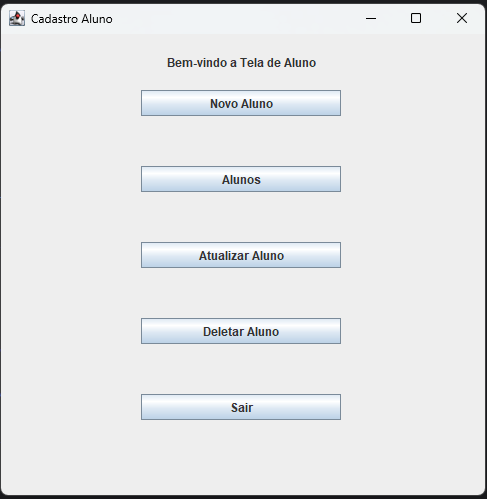
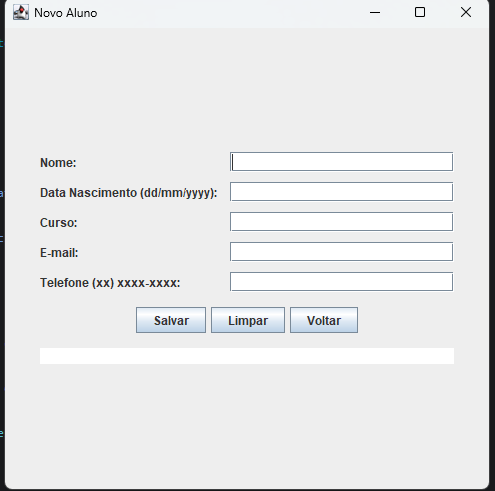
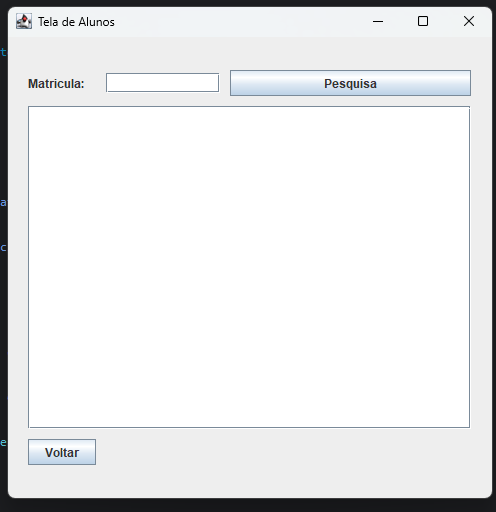
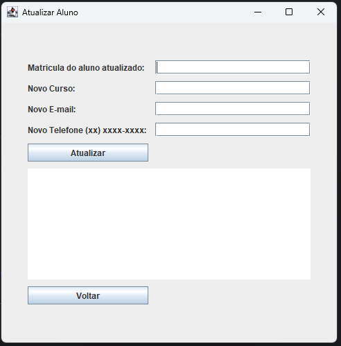
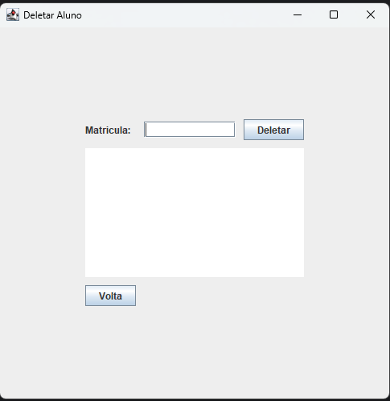

# Cadastro de Alunos

Este é um projeto pessoal desenvolvido com o objetivo de aprimorar minhas habilidades em Programação Orientada a Objetos (POO), JDBC e interface gráfica com Java Swing.

O sistema implementa um CRUD completo (Create, Read, Update, Delete) para a administração de alunos, permitindo o cadastro, consulta, atualização e exclusão de registros.

O projeto visa simular um ambiente real de aplicação, integrando a camada de interface com banco de dados de forma prática e funcional.


## Aprendizados

Durante o desenvolvimento deste projeto, conseguir aprimorar significativamente minhas habilidades em Programaçãoo Orientada a Objeto (POO) e no uso do JDBC para integração com banco de dados.

Além disso, aprendi a utilizar o Java Swing para criar interfaces gráficas. Como eu não tinha muita experiência com essa tecnologia, foi um grande desafio - mas extremamente enriquecedor - implementar uma interface funcional e intuitiva.


## Demonstração

Tela de opções de CRUD dos alunos



Tela de Cadastro de Aluno, com validação de formatação para campos como telefone e data de nascimento.



Tela para exibir todos os alunos. Caso o campo de matrícula esteja vazio, serão exibidos todos os registros cadastrados. Se uma matrícula for informada, será exibido apenas o aluno correspondente.



Tela de atualização de aluno, com validação de formatação para campos como telefone e data de nascimento.



Tela de deleção de aluno.



## Como usar
### Pré-requisitos:
- Java JDK 11 ou superior instalado
- IDE como Eclipse ou Intellij
- Banco de dados MySQL

### Passo para roda o projeto

1. Clone o repositório:
```bash
  git clone https://github.com/RyanRafaelA/Cadastro_Alunos.git
```

2. Importe o projeto na sua IDE
- Abra no Eclipse ou Intellij
- Importe o projeto como um projeto Maven

3.Configure o banco de dados
- Execute o script schema.sql, que esta na pasta src/main/resouces

4. Atualize os dados de conexão no código
- No arquivo db.properties, atualize o usuario e a senha

5. Execute a aplicação
- Rode a classe principal
- A interface Swing será exibida com as funcionalidades do sistema